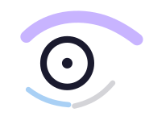
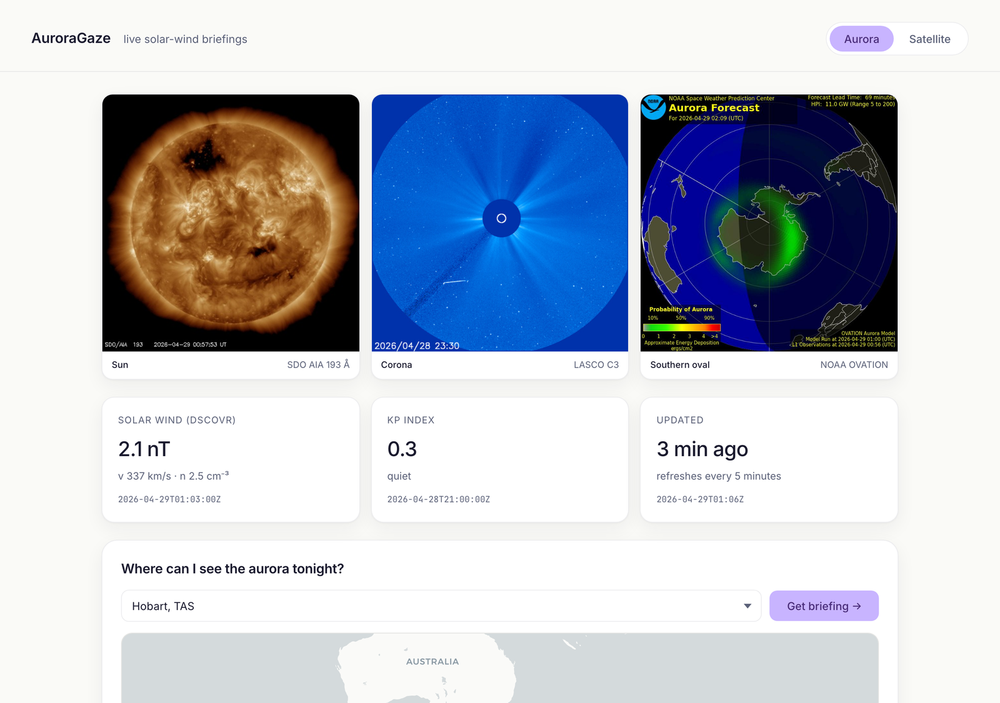
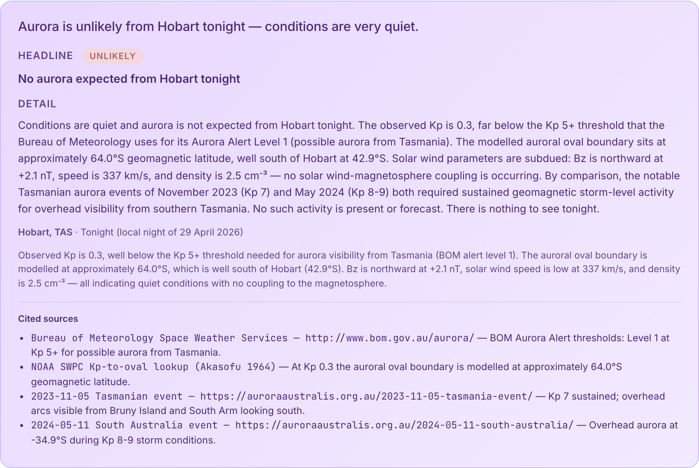
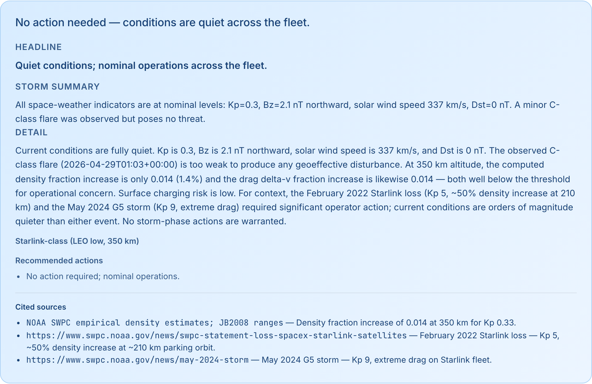
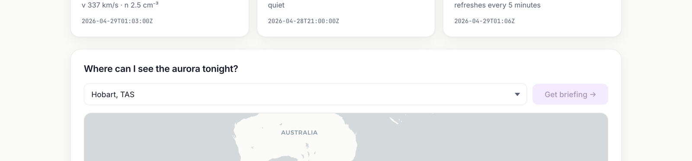
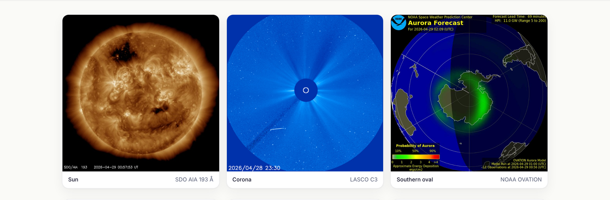

<p align="center">
  
</p>

# AuroraGaze

> Live solar-wind briefings for southern-hemisphere aurora chasers and satellite operators. Real DSCOVR data, multi-agent reasoning, grounded citations.

[](https://github.com/Ahmad-Jaradat-Space/auroragaze/actions/workflows/ci.yml)

### → [Open the live demo](https://auroragaze.fly.dev)



---

## Why it exists

Two communities watch the same upstream physics and need two completely different translations to action. Existing tools serve neither well.

### Aurora chasers in southern Australia and New Zealand

Tasmania, Victoria, southern South Australia, the South Island of NZ — there is a serious community that watches the southern auroral oval (90 000+ in the *Aurora Australis* Facebook group, the public archive at `auroraaustralis.org.au`, tourism operators around Hobart and Bruny Island). Existing tools give them either bare indices ("Kp is 7") or northern-hemisphere-centric forecasts. The translation gap is between the upstream measurement and the actual viewing decision: *should I drive to the dark-sky site tonight, what time, facing which way?*



### Satellite operators

In February 2022 SpaceX deployed 49 Starlink satellites into a 210 km parking orbit. A small geomagnetic storm hit a day later. Thermospheric density at that altitude roughly doubled, atmospheric drag overwhelmed the satellites' ability to climb, and **38 of 49 re-entered**. The storm was small; the operational impact was severe. That event is the canonical case for *storm-time density forecasts existed but weren't translated into ops actions in time*. Operators today still see NOAA G-scales and read bulletins by hand.



Same physics. Two translations to action. **One product.**

---

## What it is

AuroraGaze polls live solar-wind data at L1 (NOAA DSCOVR), runs it through a multi-agent system, and produces grounded briefings with citations. For aurora chasers the briefing is **scoped to TONIGHT's local viewing window** — evening, astronomical night, and dawn — using NOAA's 3-day Kp forecast and a pure-Python solar-position computation, not "right now." Open the live demo, pick a city or a fleet, click *Get briefing*, and watch the agent trace stream live as it works.



Live imagery from NASA SDO and NOAA SWPC sits above the data widgets so the system feels like an instrument, not a dashboard:



### → [Try it now](https://auroragaze.fly.dev)

---

## How it works

```
              ┌─────────────────┐
              │   supervisor    │  sets persona, query
              └─────────┬───────┘
                        │
        ┌───────────────┴───────────────┐
        ▼ (parallel)                    ▼ (parallel)
  ┌──────────────┐               ┌──────────────────────┐
  │ data_fetcher │               │      retrieval       │
  │ 4 NOAA tools │               │ dense + BM25 → RRF   │
  └──────┬───────┘               │  multi-query → top-5 │
         │                       └──────────┬───────────┘
         ▼                                  │
  ┌──────────────┐                          │
  │ nearby_spots │ (aurora only)            │
  │ OSM + cloud  │                          │
  │ + ranker     │                          │
  └──────┬───────┘                          │
         └──────────────┬───────────────────┘
                        ▼
                 ┌─────────────┐
                 │   physics   │  pure functions
                 │ vis OR fleet│  (oval, drag, window)
                 └─────┬───────┘
                       │
              ┌────────┴─────────┐
              ▼ persona=aurora   ▼ persona=satellite
       ┌─────────────────┐  ┌──────────────────────┐
       │ aurora_composer │  │ satellite_composer   │
       │   LLM call      │  │     LLM call         │
       └────────┬────────┘  └──────────┬───────────┘
                └──────────┬───────────┘
                           ▼
                  ┌─────────────────┐
                  │    verifier     │  every number must trace
                  │ pure-Python    │  to a tool or chunk
                  └────────┬────────┘
                           ▼ (one retry on rejection)
                          END
```

Eight nodes, **one LLM call** per briefing (two if the verifier rejects and retries — happens on ~10% of runs). The intelligence lives in the retrieval, physics, and ranker layers, not in token sampling. The composer's only job is to write a cited paragraph from typed state — it never invents a number, and the verifier enforces this deterministically. ADRs in [`docs/decisions/`](docs/decisions/) carry the full rationale.

### Stack

- **DeepSeek V3** (`deepseek-chat`) via `langchain-deepseek` — provider-agnostic factory, swap with one env var.
- **LangGraph** — seven-node graph, parallel `data_fetcher` ‖ `retrieval`, conditional persona routing, verifier with one-retry.
- **Time-aware visibility** — `tools/night.py` runs the NOAA solar-position algorithm (Julian day → declination → hour angle) in pure Python to compute sunset / civil dusk / astronomical night / sunrise per latitude+longitude+date. `tools/kp_forecast.py` reads NOAA SWPC's 3-hour Kp forecast and `physics.visibility_for_window` picks the peak Kp inside local night, returning a per-sub-window verdict (evening / night / dawn).
- **Drive-radius spot ranker** — chasers don't sit at home. A 5–300 km radius slider drives `tools/spots.py` (OpenStreetMap Overpass viewpoints / peaks / reserves), `tools/cloud.py` (Open-Meteo cloud-cover forecast for tonight's window), and an OSM-population light-pollution proxy. `tools/ranker.py` blends geomagnetic latitude, cloud cover, Bortle estimate, and drive distance into a single 0..1 score per candidate. Output: a ranked list of named spots with a one-sentence rationale each.
- **Hybrid retrieval** — ChromaDB + `bge-small-en-v1.5` dense + `rank-bm25` lexical, fused via Reciprocal Rank Fusion (k=60). Multi-query expansion for satellite (per orbit class). The cross-encoder reranker was tested and dropped — on a 35-doc curated corpus it added image bloat and a 4 GB RAM requirement without earning eval points.
- **FastAPI + SSE** streaming the agent trace; **single-page HTML + Tailwind CDN + Leaflet** frontend with public-facing tooltips, live SDO/LASCO/OVATION imagery, and a three-segment evening/night/dawn viewing-window bar.
- **MCP server** (FastMCP) exposing seven primitives to MCP clients, including `nearby_viewing_spots(lat, lon, radius_km)` for the ranked spot survey.
- **Docker** multi-stage build, **Fly.io** Sydney region (2 GB shared-cpu-2x, one machine always warm).

---

## Eval

40-event golden set, 20 aurora and 19 satellite, hand-curated against NOAA SWPC archives and `auroraaustralis.org.au` reports. Latest run on `main`:

| | cited | grounded | correct |
|---|---|---|---|
| aurora (n=20) | 1.00 | **1.00** | 0.95 |
| satellite (n=19) | 1.00 | **1.00** | **1.00** |
| **overall (n=40)** | **0.98** | **0.98** | **0.95** |

**Overall precision 0.967** — CI gate at 0.80, calibration in [`eval/calibration.md`](eval/calibration.md). `grounded` is checked by the same deterministic verifier that runs in production (every number in the briefing must trace to a tool output or a corpus chunk within ±5% relative or ±0.5 absolute, sign-insensitive). `cited` and `correct` use deterministic checks combined with an LLM judge cross-vote.

Reproduce locally:

```
python eval/run_eval.py --out eval/results.json
python eval/judge.py --in eval/results.json --out eval/results_judged.json
```

---

## MCP

Seven tools available to any MCP client. To install in Claude Desktop, add to `~/Library/Application Support/Claude/claude_desktop_config.json`:

```json
{
  "mcpServers": {
    "auroragaze": {
      "command": "/path/to/auroragaze/.venv/bin/python",
      "args": ["-m", "auroragaze.mcp_server.server"],
      "env": { "DEEPSEEK_API_KEY": "sk-..." }
    }
  }
}
```

Tools: `get_solar_wind`, `get_kp_now`, `get_dst_now`, `assess_visibility`, `compute_drag_delta_tool`, `retrieve_context`, `nearby_viewing_spots`.

---

## Run locally

```
git clone https://github.com/Ahmad-Jaradat-Space/auroragaze
cd auroragaze
uv venv --python 3.11 .venv && source .venv/bin/activate
uv pip install -e ".[dev]"
cp .env.example .env  # fill DEEPSEEK_API_KEY
python -c "from auroragaze.retrieval.ingest import ingest_corpus; ingest_corpus()"
uvicorn auroragaze.api.main:app --reload
# open http://localhost:8000
```

CLI:

```
python -m auroragaze brief --lat -42.88 --lon 147.32 --location Hobart
python -m auroragaze fleet-brief --fleet examples/fleet.json --label "LEO constellation"
```

## Deploy

```
fly launch --copy-config --no-deploy
fly secrets set DEEPSEEK_API_KEY=sk-...
fly deploy
```

The image bakes in the embedding model and an ingested ChromaDB so the container boots ready-to-serve. See [`deploy/hetzner.md`](deploy/hetzner.md) for the alternative single-VPS path.

---

## Repository layout

```
auroragaze/
├── src/auroragaze/
│   ├── graph.py                 # 8-node LangGraph wiring
│   ├── schemas.py               # Pydantic models at every I/O boundary
│   ├── llm.py                   # provider factory (DeepSeek default)
│   ├── config.py
│   ├── agents/
│   │   ├── prompts.py           # aurora + satellite composer prompts
│   │   └── verifier.py          # pure-Python number-grounding check
│   ├── tools/
│   │   ├── solar_wind.py        # DSCOVR plasma + magnetic field
│   │   ├── kp.py                # NOAA Kp (now)
│   │   ├── kp_forecast.py       # NOAA 3-day Kp forecast
│   │   ├── dst.py               # Kyoto WDC Dst
│   │   ├── xray.py              # GOES X-ray flux
│   │   ├── physics.py           # oval, visibility-for-window, fleet drag
│   │   ├── night.py             # solar-position → twilight per lat/lon/date
│   │   ├── drag.py              # thermospheric density × ballistic coef
│   │   ├── fleet.py             # per-orbit-class drag aggregation
│   │   ├── spots.py             # OSM Overpass: viewpoints, peaks, reserves
│   │   ├── cloud.py             # Open-Meteo cloud forecast in night window
│   │   ├── light_pollution.py   # OSM-population Bortle proxy
│   │   └── ranker.py            # weighted blend → ranked spot list
│   ├── retrieval/
│   │   ├── ingest.py            # chunking + embed → ChromaDB
│   │   └── retriever.py         # dense + BM25 → RRF (k=60)
│   ├── api/
│   │   ├── main.py              # FastAPI app, CORS, lifespan
│   │   └── routes.py            # /brief, /fleet-brief, SSE trace
│   ├── mcp_server/server.py     # 7 FastMCP tools
│   ├── __main__.py              # `python -m auroragaze brief …`
│   └── __init__.py
├── frontend/
│   ├── index.html               # single-page UI, Tailwind CDN, Leaflet
│   ├── auroragaze-mark.svg
│   └── auroragaze-favicon.svg
├── eval/
│   ├── golden_set.jsonl         # 40 curated events (20 aurora, 19 satellite)
│   ├── run_eval.py
│   ├── judge.py                 # LLM-judge cross-vote
│   ├── results.json
│   ├── results_judged.json
│   └── calibration.md
├── redteam/                     # adversarial prompt traces
├── reliability/                 # chaos test scaffolding
├── tests/
│   ├── unit/                    # one test file per tool / schema
│   └── integration/             # graph-level smoke tests
├── docs/
│   ├── decisions/               # ADRs 0001–0006
│   ├── blog/
│   └── img/                     # README + social images
├── deploy/hetzner.md            # single-VPS alternative
├── examples/fleet.json          # sample LEO constellation input
├── Dockerfile                   # multi-stage, embedding model baked in
├── fly.toml                     # Sydney region, 2 GB shared-cpu-2x
├── pyproject.toml
├── CLAUDE.md                    # project rules for AI assistants
└── README.md
```

---

## Architecture decisions

The load-bearing choices, each as its own ADR:

1. [DeepSeek over Anthropic](docs/decisions/0001-llm-provider.md) — cost discipline and provider lock-in.
2. [Hard-coded graph, not ReAct](docs/decisions/0002-graph-shape.md) — deterministic pipeline, debuggable, predictable cost.
3. [ChromaDB + BGE hybrid retrieval](docs/decisions/0003-rag-stack.md) — self-contained retrieval, swappable.
4. [MCP exposes primitives, not the briefing](docs/decisions/0004-mcp-scope.md) — tools compose; black-box endpoints don't.
5. [Physics is plain Python, not an LLM call](docs/decisions/0005-physics-not-llm.md) — the engineer knows when *not* to use the LLM.
6. [Drive-radius and ranked spots](docs/decisions/0006-radius-and-ranking.md) — chasers don't sit at home; the briefing answers *where to drive*.

---

## Out of scope

- Forecasting geomagnetic activity. AuroraGaze *consumes* NOAA SWPC's 3-day Kp forecast and translates it; it does not produce its own. Solar geometry (sunset, twilight) is the only nontrivial math we run.
- Northern-hemisphere aurora.
- Vendor-specific safe-mode procedures.
- Authoritative regulatory advice. Briefings are decision-support.

---

## Why I built this

Geodesy and space-weather sit close to each other — both watch the same solar wind, both need it translated into action. The February 2022 Starlink loss is the case where storm-time density forecasts existed but weren't translated into ops actions in time. Australia has one of the world's most active southern-hemisphere aurora communities, but operational tools are northern-hemisphere-centric or bare indices. Same physics, two translations to action — one product.

Sources: NOAA SWPC, DSCOVR, GOES, Kyoto World Data Center, NASA SDO, `auroraaustralis.org.au`, Bureau of Meteorology Space Weather Services.

---

## About the author

**Ahmad Jaradat** — PhD scientist with a background in geodesy and space weather, building production-grade AI systems. AuroraGaze applies that background end-to-end: real solar-wind data, a multi-agent LLM system, grounded physics, and a UI for both technical and non-technical readers.

- LinkedIn: [linkedin.com/in/ahmad-jaradat-vlbi](https://www.linkedin.com/in/ahmad-jaradat-vlbi/)
- GitHub: [@Ahmad-Jaradat-Space](https://github.com/Ahmad-Jaradat-Space)
- Email: jaradat08@gmail.com

Open to AI / LLM engineering roles. Comfortable across the stack — Python, retrieval, agents, evals, observability, and the discipline to know when a problem does not need an LLM.

---

## License

MIT © 2026 Ahmad Jaradat. See [`LICENSE`](LICENSE).

---

## Brand assets

| Asset | Path | Use |
|---|---|---|
| Header lockup | `frontend/auroragaze-mark.svg` | site header, README |
| Favicon | `frontend/auroragaze-favicon.svg` | browser tab |
| Social preview | `docs/img/auroragaze-social.png` | upload via repo Settings → Social preview |
| Avatar | `docs/img/auroragaze-avatar.png` | upload via GitHub profile / org settings |
